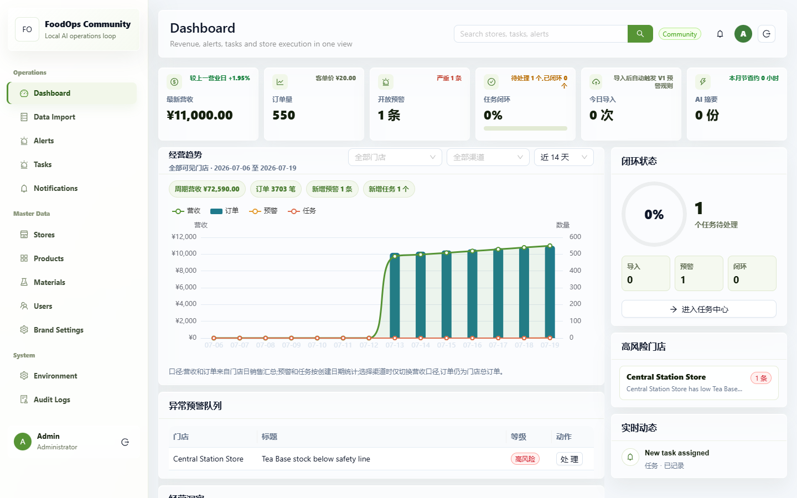
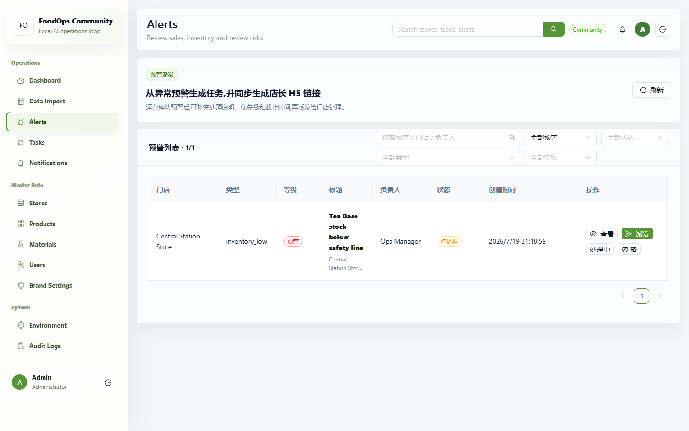
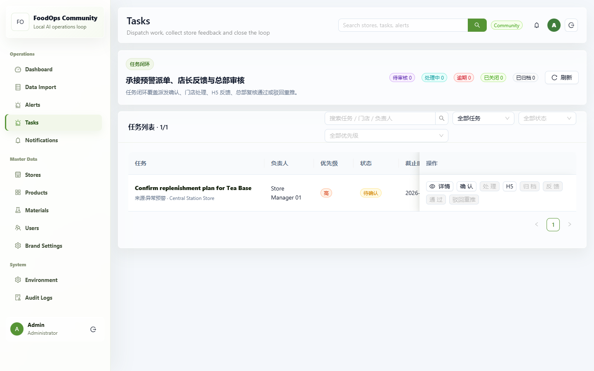
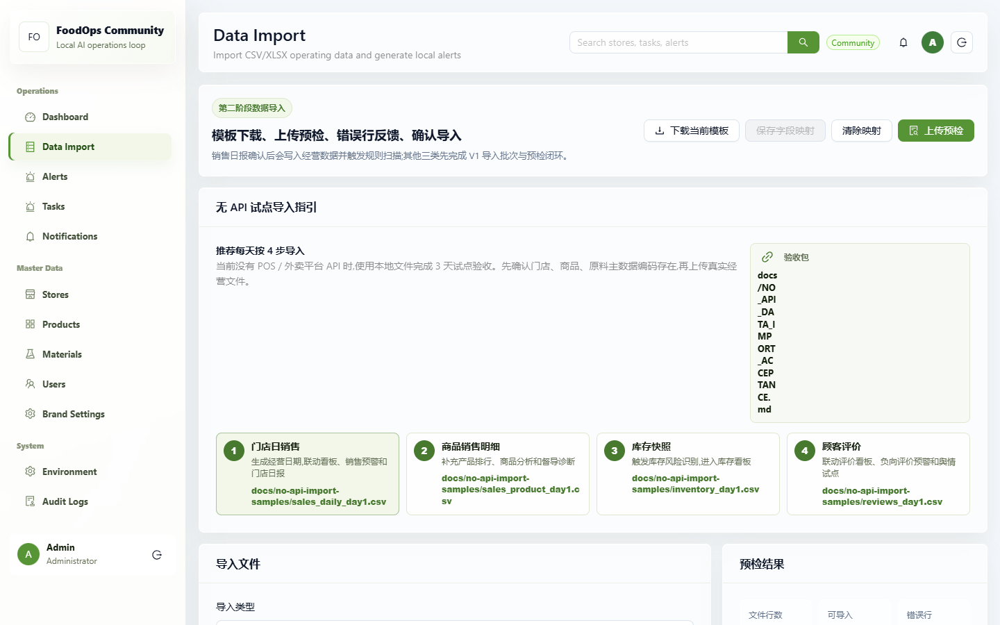

# FoodOps Community


[](https://github.com/wangsalin/foodops/actions/workflows/ci.yml)
[](LICENSE)
[](backend)
[](frontend)

`FoodOps Community` 是一个面向连锁餐饮、茶饮、烘焙等多门店团队的开源本地经营系统。它把“数据导入 -> 经营看板 -> 异常预警 -> 任务派发 -> 门店 H5 反馈 -> 总部复核 -> 审计沉淀”放在一个可自托管的工作流里。

它不是外卖平台，也不是要替代美团、抖音生活服务、ERP 或 POS。FoodOps 更适合做一个本地优先的经营底座：把不同来源的数据汇总起来，让总部可以发现问题、派发动作、跟踪反馈，并把过程沉淀下来。

> This repository is a clean community export. Do not publish the parent/private product repository or its git history.

## 目录

- [为什么需要这个项目](#为什么需要这个项目)
- [功能特性](#功能特性)
- [产品预览](#产品预览)
- [快速开始](#快速开始)
- [AI Agent 安装](#ai-agent-安装)
- [项目边界](#项目边界)
- [路线图](#路线图)
- [贡献指南](#贡献指南)

## 为什么需要这个项目

很多餐饮门店不是没有数据，而是数据散在 POS、外卖后台、表格、群消息、巡店记录和人工反馈里。总部看到异常以后，常见动作还是截图、发群、催办、跟进、复核。问题可能处理了，但过程没有结构化沉淀，下一次仍然靠人盯。

FoodOps Community 的优势是把“看见问题”和“推动处理”连起来：

- **开源透明**：代码、数据库结构、业务逻辑都可审查，开发者可以 fork、改造和贡献。
- **本地优先**：核心经营数据保存在自托管的 PostgreSQL 中，适合内部试点、私有化部署和数据治理。
- **不绑定单一平台**：早期可从 CSV/XLSX 开始，后续再接 POS、外卖平台、ERP 或自研系统 API。
- **不只做看板**：异常预警可以转成任务，任务可以派给负责人，门店可以通过 H5 反馈，总部可以复核。
- **适合真实门店执行**：门店负责人不一定要登录完整后台，通过手机 H5 链接即可提交结果、备注和图片。
- **可审计可复盘**：关键动作都有留痕，方便后续做复盘、责任追踪、绩效分析和自动化优化。

## 功能特性

| 模块 | 当前状态 | 说明 |
| --- | --- | --- |
| 主数据 | 已完成 | 租户、部门、角色、用户、门店、商品、原料、供应商 |
| 数据导入 | 已完成 | 支持销售、商品销售、库存、评价等本地经营数据导入 |
| 经营看板 | 已完成 | 营收、订单、预警、任务、导入批次集中展示 |
| 规则预警 | 已完成 | 基于本地规则识别库存、评价、销售等经营异常 |
| 预警转任务 | 已完成 | 预警可派发为任务，带负责人、截止时间和状态流转 |
| 门店 H5 反馈 | 已完成 | 门店通过 H5 链接提交处理结果和图片 |
| 总部审核 | 已完成 | 支持反馈复核、通过关闭、驳回重推 |
| 通知与审计 | 已完成 | 系统通知和关键操作审计留痕 |
| AI 摘要/智能派单 | 规划中 | 方向明确，但社区核心先保持本地规则和可解释流程 |
| 外部平台连接器 | 规划中 | 建议以插件边界接入，不直接塞进社区核心 |

### FoodOps 和平台/ERP 的关系

| 类型 | 典型职责 | FoodOps 的定位 |
| --- | --- | --- |
| 美团/抖音生活服务 | 流量、交易、评价、平台经营工具 | 不替代平台，后续可接平台数据 |
| POS/ERP | 收银、库存、采购、财务、门店基础业务 | 不替代核心业务系统，作为运营动作层 |
| 表格/人工群 | 临时汇总、人工催办、巡店反馈 | 把临时动作结构化成可追踪流程 |
| FoodOps Community | 数据汇总、预警、任务、反馈、审核、审计 | 开源自托管的经营闭环底座 |

## 产品预览

### 经营看板



### 异常预警



### 任务闭环



### 本地导入



## 快速开始

### 1. 准备环境变量

Windows PowerShell:

```powershell
Copy-Item .env.example .env
```

macOS / Linux:

```bash
cp .env.example .env
```

默认 demo 管理员账号在 `.env.example` 中：

```text
INIT_ADMIN_USERNAME=admin
INIT_ADMIN_PASSWORD=change-me-before-shipping
```

### 2. 启动本地基础设施

```bash
docker compose up -d
```

### 3. 准备后端

Windows PowerShell:

```powershell
cd backend
python -m venv .venv
.\.venv\Scripts\Activate.ps1
pip install -r requirements.txt
alembic upgrade head
python scripts\seed_community.py
uvicorn main:app --reload --host 0.0.0.0 --port 23101
```

macOS / Linux:

```bash
cd backend
python -m venv .venv
. .venv/bin/activate
pip install -r requirements.txt
alembic upgrade head
python scripts/seed_community.py
uvicorn main:app --reload --host 0.0.0.0 --port 23101
```

### 4. 启动前端

```bash
cd frontend
npm install
npm run dev
```

打开 `http://127.0.0.1:23000`。

## AI Agent 安装

如果你准备把这个仓库交给 `Codex`、`Claude Code`、`OpenClaw`、`Qwen Code` 等 Agent 来安装和试跑，可以把下面这份提示词一起发给它：

- [Agent Bootstrap Prompt](docs/agent-bootstrap.md)

这份提示词会要求 Agent：

- 先阅读 README、架构说明和贡献边界
- 复制 `.env.example` 并启动 Docker 基础设施
- 执行数据库迁移和 demo seed
- 启动前后端
- 打开本地页面做一次基础烟测
- 运行后端编译检查和前端生产构建

## 开发验证

提交 PR 前建议至少运行：

```bash
cd backend
python -m compileall app main.py scripts
python -m py_compile alembic/versions/000001_init_community.py

cd ../frontend
npm run build
```

## 项目边界

社区版包含：

- 主数据、手工导入、经营看板、本地规则预警、任务闭环、H5 反馈、通知、审计
- 单一压缩数据库迁移和 demo seed
- 可自托管的 FastAPI + Next.js + PostgreSQL + Redis 基础栈

社区版暂不包含：

- 企业微信、飞书、SSO、客户专属连接器等企业集成
- 外部 AI 模型供应商、知识库助手、自治 agent runtime
- 舆情采集、社媒运营、设计生成、预测模型、私有品牌资产
- 任何客户数据、浏览器 profile、上传文件、运行日志或部署密钥

这些能力更适合以插件、企业版或私有部署边界接入，而不是直接合并到社区核心。

## 路线图

当前社区重点：

1. 稳定本地经营闭环：补充 demo 数据、导入模板、预警和任务测试。
2. 优化贡献体验：一键本地启动脚本、更多示例文件、截图和 smoke test。
3. 深化运营能力：更多可配置规则、任务审核历史、审计筛选和经营报告。

完整路线图见：[docs/ROADMAP.md](docs/ROADMAP.md)。

## 贡献指南

欢迎各种形式的贡献：

- 跑一下本地环境，反馈安装文档哪里不顺。
- 提一个真实餐饮门店运营场景 issue。
- 补充一个导入模板或校验规则。
- 优化一个页面、接口、预警规则或测试。
- 提出插件边界方案，而不是把企业连接器直接塞进社区核心。

开始前请阅读：

- [CONTRIBUTING.md](CONTRIBUTING.md)
- [SECURITY.md](SECURITY.md)
- [PUBLISHING.md](PUBLISHING.md)
- [PRODUCT.md](PRODUCT.md)
- [docs/ARCHITECTURE.md](docs/ARCHITECTURE.md)

如果这个项目对你有帮助，欢迎 Star、Fork、提 Issue 或发 PR。
