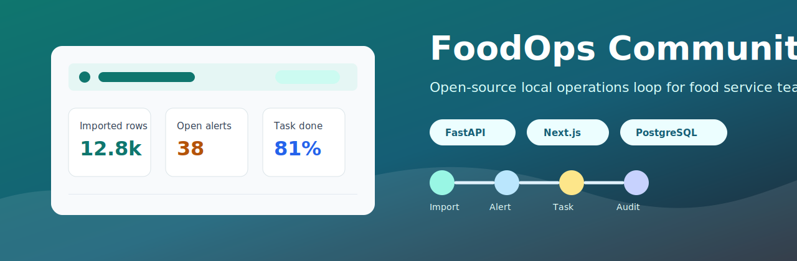
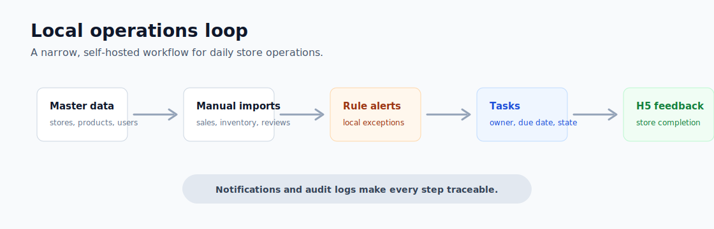
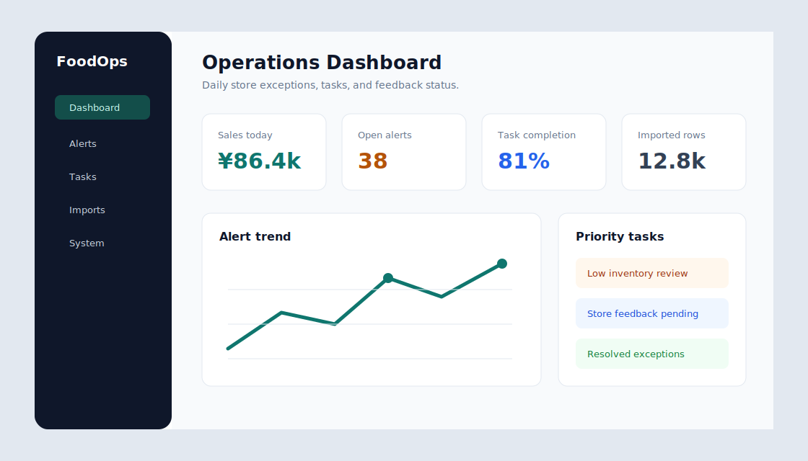
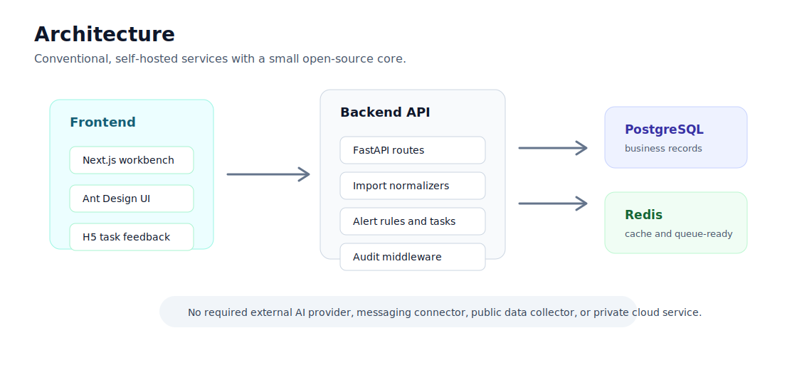

# FoodOps Community



[](https://github.com/wangsalin/foodops/actions/workflows/ci.yml)
[](LICENSE)
[](backend)
[](frontend)

FoodOps Community is a local-first operations loop for chain food and beverage teams. It keeps the smallest useful workflow open: master data, manual imports, dashboards, rule-based alerts, task dispatch, H5 task feedback, in-app notifications, and audit logs.

This repository is a clean community export. Do not publish the parent/private product repository or its git history.

## What It Does



- Import local business data for sales, product sales, inventory, and reviews.
- Monitor store and product performance from an operations dashboard.
- Convert rule-based exceptions into tasks with owners and due dates.
- Let store teams complete H5 feedback without external messaging platforms.
- Keep system notifications and audit logs inside the self-hosted stack.

## Product Preview



The community core is intentionally narrow. It is built for teams that want a self-hosted operating loop before investing in private integrations, enterprise messaging, AI providers, or customer-specific automation.

## Scope

Included:

- Tenant, department, role, user, store, product, material, and supplier master data
- Manual imports for sales, product sales, inventory, and reviews
- Dashboard, local rule alerts, alert-to-task flow, task H5 feedback, and review history
- In-app system notifications
- Audit logs and local environment status
- A single compressed database migration and demo seed

Not included:

- Enterprise connectors such as WeCom, Feishu, external access relay, and customer-specific SSO
- External AI model providers, prompt routing, knowledge assistants, or autonomous agent runtimes
- Public-opinion collection, social media workflows, design generation, forecasting, and private brand assets
- Any private customer data, browser profiles, uploads, runtime logs, or deployment secrets

## Architecture



More detail: [Architecture Notes](docs/ARCHITECTURE.md).

## Quick Start

1. Copy environment variables:

```bash
cp .env.example .env
```

2. Start local infrastructure:

```bash
docker compose up -d
```

3. Prepare backend:

```bash
cd backend
python -m venv .venv
. .venv/Scripts/activate
pip install -r requirements.txt
alembic upgrade head
python scripts/seed_community.py
uvicorn main:app --reload --host 0.0.0.0 --port 23101
```

4. Start frontend:

```bash
cd frontend
npm install
npm run dev
```

Open `http://127.0.0.1:23000`. The demo seed prints the admin credentials after it runs.

## Development

Recommended verification:

```bash
cd backend
python -m compileall app main.py scripts
python -m py_compile alembic/versions/000001_init_community.py

cd ../frontend
npm run build
```

Community contributions should stay inside the included scope. Enterprise integrations should be proposed as plugin boundaries rather than merged into the core loop.

## Roadmap

See [Roadmap](docs/ROADMAP.md) for the next community milestones.

## Launch Materials

Maintainers can use the [Marketing Kit](docs/marketing/README.md) for the first public launch and developer recruiting wave.

## Community

- Contribution guide: [CONTRIBUTING.md](CONTRIBUTING.md)
- Security policy: [SECURITY.md](SECURITY.md)
- Publishing checklist: [PUBLISHING.md](PUBLISHING.md)
- Product notes: [PRODUCT.md](PRODUCT.md)
- Maintainer setup: [docs/MAINTAINER_SETUP.md](docs/MAINTAINER_SETUP.md)
